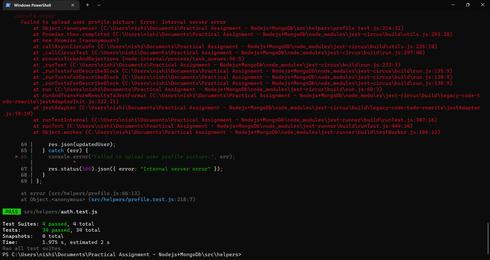
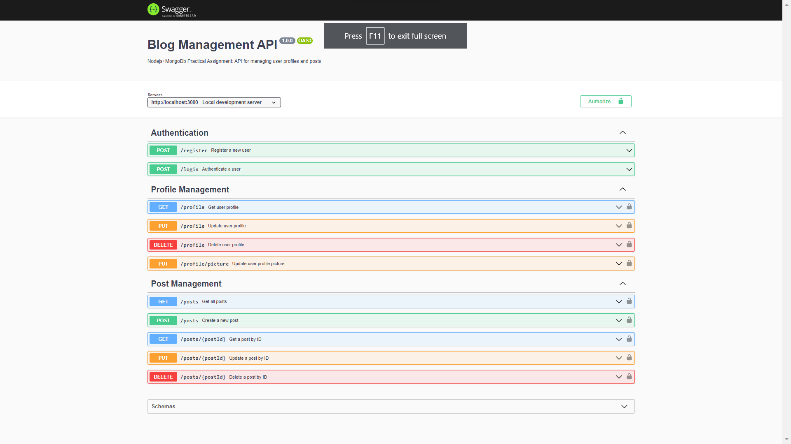

[](https://github.com/nishipalrana/express-js-post-management-api/actions/workflows/node.js.yml)
# Post Management API
#### Author: Nishipal Rana
#### Name: Express-post-app
#### Version: 1.0.0
#### Description: Nodejs+MongoDb Express Post Management API 
#### Main File: `src/app.js`
<br>

-------

## Project Details
A RESTful API that allows users to create, update, delete and view their profiles. Users can authenticate and authorize themselves to access their profile information. The application also allow users to create, update, delete, and view their posts.

Authentication and Authorization:	
- Users can register and log in using their email and password.
- Passwords is encrypted and stored securely in the database.
- Users are only authorized to access their own profile information and posts.

Profile Management:
- Users can create, update, delete and view their profiles.
- The profile information includes name, email, address, and profile picture.
- Users can upload and update their profile picture.

Post Management:
- Users can create, update, delete, and view their posts.
- Posts have a title, description, and an image.
- Posts can be tagged with keywords for easy searching.

Unit Testing:
- The unit tests are written using Jest and covers authentication, authorization, profile management and post management.


<br>

---------
## Prerequisites:
Configure following env variables in `.env` file
```
JWT_SECRET=
MONGODB_USERNAME=
MONGODB_PASSWORD=
MONGODB_CLUSTER_URL=
```

Install all the necessary dependencies
```
npm install or npm i
```

<br>

---------
## Run the application in local environment: 

<br>

```
npm run start
```
<br>

### Run the unit test cases:

<br>

```
npm run test
```
<br>



### Test the API's with Swagger Documentation: 

<br>

```
http://localhost:3000/api-docs/
```
<br>


